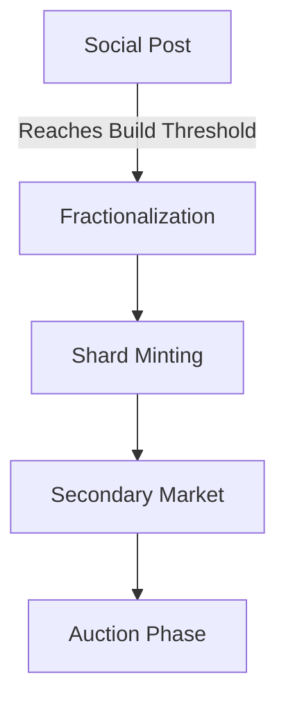

# BEWD - Fractional Social Asset Platform

## Table of Contents
- [Overview](#overview)
- [Core Concepts](#core-concepts)
- [User Workflows](#user-workflows)
- [Technical Architecture](#technical-architecture)
- [Contract Functions](#contract-functions)
- [Examples](#examples)
- [Economic Model](#economic-model)
- [Security](#security)


## Overview
BEWD transforms social media engagement into ownable digital assets by combining:
- Social posting functionality
- NFT fractionalization
- Real-world asset (RWA) tokenization
- Stellar blockchain infrastructure

## Core Concepts

### Asset Types
1. **Digital Posts**: Content with engagement thresholds
2. **Fractional NFTs**: Divided ownership of popular content
3. **RWAs**: Physical assets backing digital tokens

### Key Mechanisms
- **Build Threshold**: Number of engagements needed to fractionalize
- **Shard**: Fractional ownership unit (1 shard = 0.01% ownership by default)
- **Monetization**: Automatic when threshold reached

## User Workflows

### Creator Flow
1. Post content (image, music, video)
2. Optionally tag physical asset as RWA
3. Community builds (likes/upvotes) the post
4. At threshold:
   - Content fractionalizes into shards
   - Shards become tradable
5. Earn from:
   - Initial shard sales
   - Royalties on secondary trades
   - Final auction

### Collector Flow
1. Browse fractionalized posts
2. Purchase shards from:
   - Primary sale (from creator)
   - Secondary market (from other holders)
3. Benefits:
   - Profit from value appreciation
   - Royalty distributions
   - Voting rights (future DAO)

## Technical Architecture

### Core Components
- **Post Registry**: Tracks content and engagement
- **Fractional Engine**: Splits assets into shards
- **Trading Module**: Handles shard transfers
- **Royalty Distributor**: Manages revenue sharing

### Smart Contract Stack
1. Base: Stellar Soroban smart contracts
2. Middleware: Custom fractionalization logic
3. Interface: ERC-721 compatible with extensions

## Contract Functions

### Main Functions
| Function           | Description                                                                 |
|--------------------|-----------------------------------------------------------------------------|
| `initialize_post`  | Creates new monetizable post with configurable threshold                    |
| `build_post`       | Records engagement and checks fractionalization threshold                   |
| `transfer_shard`   | Transfers ownership of fractional shard between addresses                   |
| `claim_royalties`  | Distributes earnings to shard holders proportionally                        |

### Token Interface
| Standard Function | Implementation Details                                                     |
|-------------------|-----------------------------------------------------------------------------|
| `balanceOf`       | Returns shard count for address                                            |
| `ownerOf`         | Returns owner of specific shard                                            |
| `transferFrom`    | Handles shard transfers with royalty checks                                |


## Examples
### Artist Use Case
1. Artist Alice posts new digital artwork

2. 10,000 fans "build" (like) the post

3. System:

    - Mints 10,000 shards (1 shard = 0.01% ownership)

    - Assigns initial ownership to Alice

4. Alice sells 30% (3,000 shards) at $1 each

5. Secondary market develops for shard trading

### Collector Use Case
1. Bob buys 50 shards of Alice's artwork ($50 total)

2. Now owns 0.5% of the artwork

3. Receives:

    - 0.5% of any royalty distributions

    - Voting rights in future artist decisions

    - Exclusive content access

## Economic Model
### Revenue Streams
1. Primary Sales: Creator sells initial shards

2. Secondary Royalties: 5-10% on resales

3. Auction Premium: Final full-asset sale

### Distribution
|Recipient |	Percentage |
|----------|---------------|
|Creator |	70% |
|Shard Holders |	20% |
|Platform |	10% |

## Security
### Key Protections
1. Threshold validation

2. Reentrancy guards

3. Royalty distribution locks

4. Upgradeable contract architecture

### Audit Considerations
1. Shard ownership tracking

2. Threshold calculation integrity

3. RWA verification processes


## Overview
BEWD is a decentralized platform that transforms social media engagement into ownable digital assets. It combines:
- Social media functionality (posts, likes)
- NFT fractionalization
- Real-world asset (RWA) tokenization
- Stellar blockchain integration

## Core Concepts

### 1. Asset Types
| Type          | Description                          | Example               |
|---------------|--------------------------------------|-----------------------|
| Digital Posts | Content with engagement threshold    | Artwork post          |
| Fractional NFTs| Divided ownership of popular content | n shards of a song |
| RWAs          | Physical assets backing digital ones | Signed physical artwork|

### 2. Key Components



# 🔥 BEWD: Own the Posts You Love  
**Turn social engagement into fractional ownership** – built on Stellar.  

## 🎯 Hackathon Focus  
- **Problem:** Creators struggle to monetize; fans want to invest in culture.  
- **Solution:** Viral posts → tokenized shards → tradable assets.  

## ✨ Key Features  
✅ **"Fuel" replace likes** → unlocks fractionalization  
✅ **$BEWD token** (Stellar) for tipping & trading  
✅ **1-click shard purchases**  

 

## 🛠️ Tech Stack  
- **Frontend:** Next.js (or Svelte) + Tailwind  
- **Backend:** Node.js + Stellar SDK  
- **Smart Contracts:** Stellar Soroban (for tokens/shards)  

## 🔥 How to Run Locally  
```bash
git clone [repo-url]
cd bewd
npm install
npm run dev